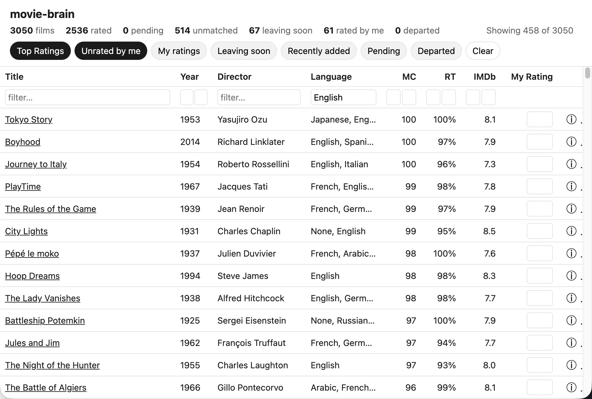

# movie-brain

Personal film brain: it syncs the Criterion Channel catalog and OMDb ratings into a local SQLite database, tracks your own 0–10 ratings, and serves everything through a local Flask dashboard for browsing, filtering, and rating. Everything runs on your machine — the only external account is a free OMDb API key. Other listing sources (Apple Movies, etc.) may be added later.



## Getting started

1. Install [uv](https://docs.astral.sh/uv/), then install dependencies: `uv sync` (uv provides Python 3.12+).
2. Get a free OMDb API key at [omdbapi.com/apikey.aspx](https://www.omdbapi.com/apikey.aspx) and write it to `~/.config/movie-brain/omdb-api-key.txt` (or set the `OMDB_API_KEY` environment variable).
3. Migrating from criterion-ratings? Run `uv run movie-brain import-legacy` once to bring over your existing films, OMDb payloads, and ratings.
4. Run your first sync: `uv run movie-brain sync`. The first run walks the full ~3,000-film catalog in a few minutes; OMDb ratings fill in over a few days (see [Sync behavior](#sync-behavior)).
5. Start the dashboard: `uv run movie-brain dashboard`, then open <http://127.0.0.1:5556>.
6. Optional (macOS): `scripts/install-launch-agent.sh` installs a launchd agent that syncs daily at 3:00 AM and logs to `~/.config/movie-brain/sync.log`. It copies `OMDB_API_KEY` into the key file if needed, since launchd jobs don't inherit your shell environment.

## Commands

| Command | Description |
| --- | --- |
| `movie-brain sync [--full\|--ratings-only]` | Refresh the Criterion catalog and OMDb ratings. `--full` forces a complete catalog re-walk; `--ratings-only` skips Criterion and only refreshes OMDb ratings (requires a prior sync). The two flags are mutually exclusive. |
| `movie-brain dashboard [--port 5556] [--host 127.0.0.1]` | Run the local web dashboard. |
| `movie-brain import-legacy [--from DIR]` | One-shot, idempotent import of criterion-ratings JSON data (default `~/.local/share/criterion-ratings`). |
| `movie-brain export csv PATH` | Write the current watchlist as CSV. |
| `movie-brain status` | Show film, rating, and lookup counts. |

## Dashboard

The dashboard lists all films with client-side filtering and sorting:

- Filter chips stack together with AND logic.
- Column filters narrow further by title, year, director, etc.
- The Language filter is a multi-select dropdown, **defaulting to English** — films whose language is still unknown (pending lookups) are hidden until you clear it to "Any".
- Click a column header to sort by it.
- Type a 0–10 score into the **My Rating** column (in the table or the drawer) to rate a film; blank it to un-rate. 0 means not interested.
- Click a row to open the detail drawer (poster, plot, fields, sources, Criterion link, raw JSON).
- Films you rated stay listed even after they leave the Criterion Channel — dimmed, tagged "gone", and matchable with the **Departed** chip.
- Filter/sort/selection state lives in the URL, so a dashboard view is shareable via link.

## Sync behavior

A plain `sync` is cheap when nothing changed: if the last full walk is under a week old and page 1 of the catalog still matches, the stored catalog is reused. Otherwise it re-walks the whole catalog, folding in Criterion's occasional duplicate year-less film pages so they don't create duplicate rows.

Retention: films you rated are kept forever and shown as departed once they leave the channel; unrated films absent for 7+ days are purged completely.

Tripwires:

- If the Criterion catalog fetch fails, `sync` logs the error to `sync.log` and leaves the database unchanged — no partial catalog is written that run.
- If OMDb lookups fail partway through (quota exhausted or repeated errors), the films already looked up are still saved; the rest stay pending and are picked up next run. The free OMDb tier allows 1,000 lookups/day, so a full catalog fills in over a few days; the daily 3:00 AM schedule drains the backlog unattended.

## Data

Everything lives in a single SQLite database at `~/.config/movie-brain/movie-brain.db` (override the directory with `MOVIE_BRAIN_CONFIG_DIR`):

- `films` — one row per film, keyed by `film_key(title, year)`.
- `listings` — per-source catalog presence, with `first_seen`/`last_seen`/`leaving_date`; "current" means latest `last_seen`.
- `omdb` — cached OMDb lookup results and raw payload per film.
- `my_ratings` — your own 0–10 score per film.
- `meta` — sync bookkeeping (e.g. last catalog fetch date).

## Migrating from criterion-ratings

1. Run `uv run movie-brain import-legacy` to bring over films, OMDb payloads, and your ratings.
2. Verify counts against `uv run movie-brain status`.
3. Once satisfied, `launchctl unload` the old `com.jayers.criterion-ratings` launch agent so it stops running alongside movie-brain.

**Do not** delete the old `criterion-ratings` data directory until you're satisfied the migration is complete — that's your call, not something either tool automates.

## Development

```bash
uv run pytest
uv run playwright install chromium   # once, for the browser-driven dashboard tests
uv run ruff check . && uv run mypy
```

Architecture and contributor conventions live in [CLAUDE.md](CLAUDE.md).
