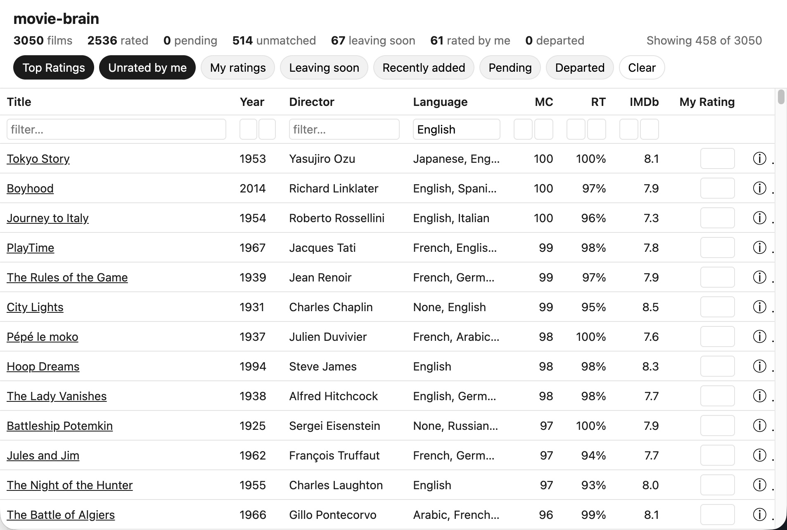

# movie-brain

A personal film brain. It gathers what I can watch (the Criterion Channel, every streaming service and store TMDB reports, my Apple TV library), what critics and canons say about it (OMDb, scraped Metacritic, curated top-N lists), and what I think of it (0–10 ratings, a tier ranker, a dated viewing log with notes) into one local SQLite database, served by a local Flask dashboard. Everything runs on my machine.



## Why it exists

**Purpose:** increase the value of my movie watching — get the best content for my goals, track what I've watched, and keep improving the loop, ultimately building real film-criticism skill. The full statement and its reframings live in [docs/vision.md](docs/vision.md).

The goals, in the order the app serves them today:

1. **Find the best thing to watch** — one catalogue across services, ranked by critics, canon lists and my own ratings, with "where can I watch it tonight" answered per film (best source first).
2. **Track what I've watched** — ratings, a hand-ordered watchlist, a viewing log with dictated notes, a "study" mark for films worth rewatching for technique.
3. **Get better at judging films** — the thinnest leg so far: a film-criticism tutor cartridge (`docs/tutor-cartridge/`) and backlog items 5 and 51 point here.

Non-goals: no accounts, no cloud, no multi-user. It is one person's tool; scale and generality are deliberately traded for correctness of that person's data.

## What's in it

| Area | What it does |
| --- | --- |
| Catalogue | Criterion Channel walk (by mediaid), TMDB watch providers for ~170 services, Metacritic streaming-browse scrape, Apple TV owned library, films added by hand |
| Identity | Every film has an immutable GUID; a "thumbprint" resolver keys films to IMDb/TMDB ids with evidence scoring and an offline accuracy gate; doubtful matches queue for human review, never guessed |
| Enrichment | OMDb ratings, TMDB credits/keywords/overview, trailers, CheapCharts store ids, semantic-search vectors — all run automatically for every new film |
| Judgement | 0–10 ratings, watchlist with hand order, tier ranker (`/rank`), curated canon lists with trust weights, my 2004–08 ratings as a signal |
| Viewing | `viewings add` logs a dated viewing + note (driven by the `log-viewing` Claude skill from dictation) |
| Search | One bar: exact + fuzzy (SQLite FTS over titles, people, characters, keywords) + semantic (sentence-transformers) |
| Shopping | CheapCharts wishlist sync and one-click "Wishlist it" from the drawer |

## Getting started

1. Install [uv](https://docs.astral.sh/uv/), then `uv sync` (Python 3.12+). Add `--extra semantic` for the semantic search stage (~420 MB model). Optional: `ln -sf "$(pwd)/bin/movie-brain" ~/.local/bin/movie-brain` so `movie-brain …` works from anywhere.
2. Keys, in `~/.config/movie-brain/credentials.toml` (mode 600) or environment variables:
   - OMDb: `[omdb] api_key` or `OMDB_API_KEY` ([get one](https://www.omdbapi.com/apikey.aspx)).
   - TMDB read token: `[tmdb] read_token` or `MOVIE_BRAIN_TMDB_TOKEN` — needed for keying, providers, credits and trailers.
   - Optional `[cheapcharts]` username/password for the wishlist.
3. `uv run movie-brain sync` — walks the Criterion catalogue, then OMDb, providers, and the enrichment chain for new films. A fresh database creates itself; an existing one advances only through `migrate --apply`.
4. `uv run movie-brain dashboard`, then open <http://127.0.0.1:5556> (tier ranker at `/rank`).

Syncs are run by hand; `scripts/install-launch-agent.sh` exists for a daily 3 AM launchd job if wanted.

## Commands (overview)

Every writing verb is a **dry run by default** and needs `--apply`. The full reference, with each verb's contract, is in [CLAUDE.md](CLAUDE.md#commands).

| Group | Verbs |
| --- | --- |
| Daily | `sync`, `dashboard`, `status`, `viewings add/list/study/remove/open` |
| Adding films | `films add ttNNN`, `owned import`, `lists import/create/trust`, `oldratings import/create/link` |
| Sources | `metacritic crawl/match/dial`, `criterion bridge`, `cheapcharts resolve/audit/wishlist`, `services …` |
| Enrichment | `enrich all/credits/trailers/criterion-directors`, `embed` |
| Data quality | `review list/resolve/revisits`, `repair …`, `audit run/verdicts`, `thumbprint backfill`, `rematch` |
| Schema | `migrate [--apply]` (backs up first; the only path that advances a DB) |

## Data

One SQLite database at `~/.config/movie-brain/movie-brain.db` (`MOVIE_BRAIN_CONFIG_DIR` moves the directory, which also holds credentials, `sync.log`, raw scrape/import archives and pre-migration backups). Core tables:

- `films` — one row per work, identity `guid`; films are never deleted (departed is a display state).
- `external_ids` — IMDb, TMDB, Criterion mediaid, Metacritic slug, iTunes store id per film.
- `listings` / `availability_transitions` / `movie_service` — where each film is available, history, and the service registry.
- `omdb`, `metacritic`, `film_credit`, `film_keyword`, `film_trailer`, `film_embedding` — enrichment.
- `my_ratings`, `watchlist`, `owned`, `viewing`, `rank_*`, `film_list*`, `old_rating` — my responses.
- `claim`, `match_review`, `audit_flags` — identity evidence and the human review queue.

Schema changes are numbered files in `migrations/`.

## Development

```bash
uv run pytest                         # whole suite (~2.5 min; pytest-bdd + Playwright)
uv run playwright install chromium    # once, for the dashboard tests
uv run ruff check . && uv run mypy
uv run python scripts/thumbprint_benchmark.py --assert   # identity-resolver gate
```

Start with [CLAUDE.md](CLAUDE.md) (architecture, rules, commands), then [docs/backlog.md](docs/backlog.md) (open work, scored) and [docs/vision.md](docs/vision.md) (why).
