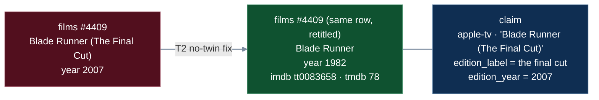
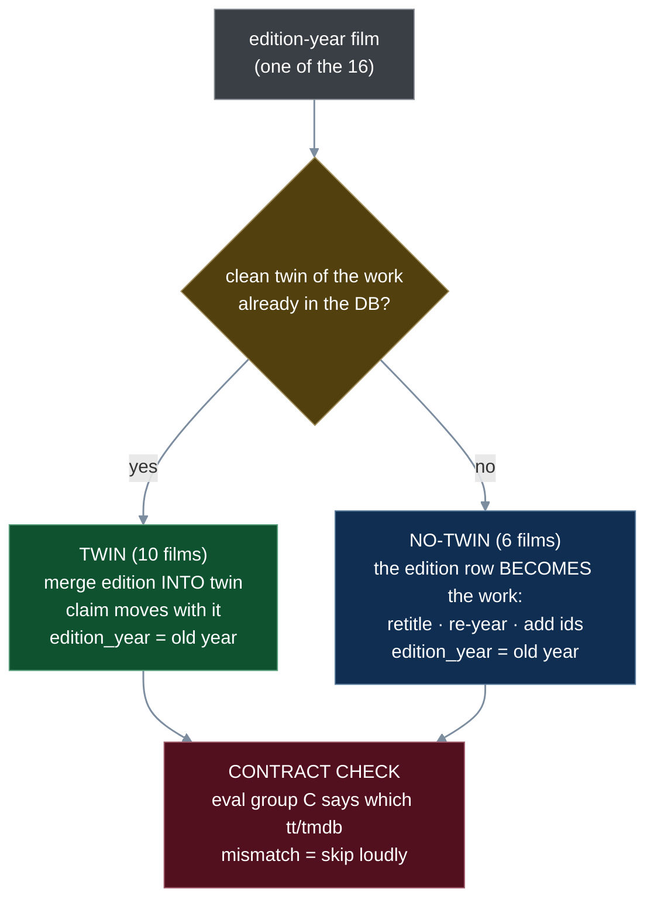
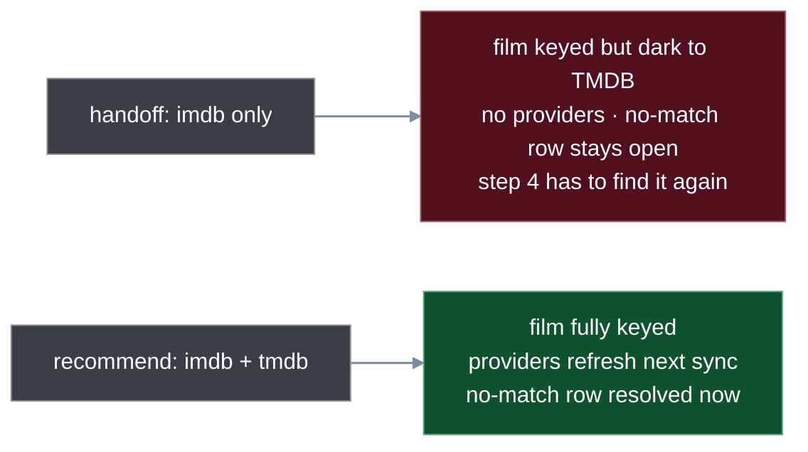
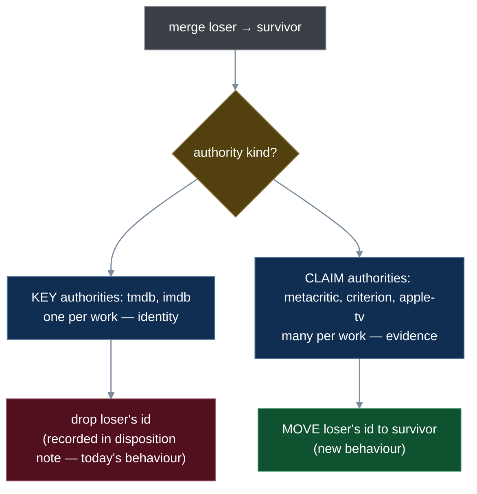
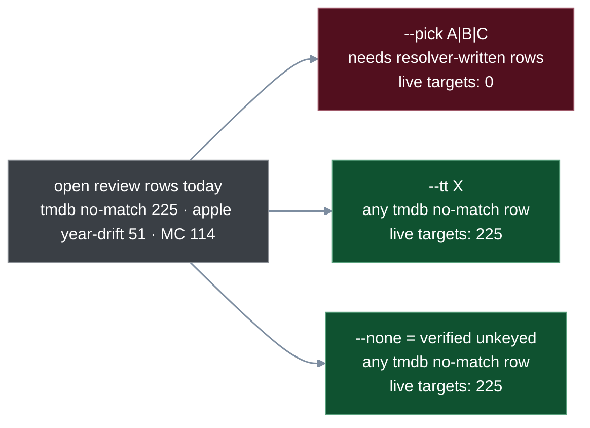
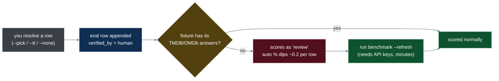

# T2 decisions brief — what you need to know to say yes/no

**Date:** 2026-08-26 · **For:** the owner, before the T2 spec is written · **Reads in:** ~8 min.
Five decisions. Each one has: the situation, a picture, what I recommend, and what happens if
you pick the other way. Nothing here has been written to the live DB.

---

## The one idea behind all of T2

A **work** is the film itself (Blade Runner, 1982). An **edition** is a version of that work
(The Final Cut, 2007). Today 16 films in the DB are really editions carrying the *edition's*
year as if it were the work's year. T2 folds each edition back into its work, and keeps the
edition year on a **claim** row (the record of "Apple/Metacritic said this title, this year").

Two shapes of fix, chosen per film by whether a clean copy of the work already exists:

Verified on the live DB (read-only): the 10 twins already hold exactly the TMDB id the
contract expects; the Overlord remake (#4269) holds a different one, so the check rejects it
by itself; no Scenes-from-a-Marriage series row exists; no title/year key collisions.

---

## Decision 1 — NO-TWIN films: IMDb id only, or IMDb + TMDB?

**Situation.** The handoff says write `external_ids imdb = tt` for the 6 no-twin films. The
contract row also carries the TMDB id. TMDB is what drives streaming availability, the
year check, and closes the film's open "no-match" review.

**Recommend:** write both. **Risk of my way:** none I can see — the TMDB id is already in
the verified contract. **If you say no:** 6 films stay half-keyed until step 4.

---

## Decision 2 — Scenes from a Marriage: what goes in `edition_year`?

**Situation.** `edition_year` means "the year this edition was released" (Final Cut 2007,
re-release 2003). #1909 "SCENES FROM A MARRIAGE: Theatrical Version" has `films.year = 1973`
— that is the **TV series** year. The theatrical film is 1974. The mechanical rule "old
year → edition_year" would record 1973 as an edition-release year, which is false.

| field | mechanical rule | recommend |
|---|---|---|
| `films.year` | 1974 | 1974 |
| `claim.year_claimed` (what Criterion said) | 1973 | 1973 (already there) |
| `claim.edition_year` | 1973 | **NULL** |

**Recommend:** NULL for #1909 only; the other 15 follow the rule. **If you say no:** one
mislabeled edition year; harmless today, misleading later when edition badges show.

---

## Decision 3 — After migration 012, what does a merge do with duplicate ids?

**Background.** `external_ids` is the table of "film ↔ native id at authority X" (tmdb,
imdb, metacritic slug, criterion URL, apple-tv). Today its primary key allows **one id per
authority per film**. Migration 012 loosens that so a work can hold, say, three Metacritic
slugs (Apocalypse Now / Redux / Final Cut). The memo asked for this; nothing in T2's 16
films needs it, but step 3 will.

**The question the handoff skips:** when a merge finds the loser and survivor both holding
an id for the same authority, keep both or drop the loser's?

**Also part of this decision — a real hazard.** Four SQL queries (the dashboard view, the
audit, Mode-B promotion, the metacritic claim backfill) join `external_ids` on the metacritic
slug. Once a film holds two slugs, those queries would show the film **twice**. I will make
each pick one slug deterministically (earliest `first_seen`) and add a test that proves the
dashboard stays one row per film. Not optional if 012 lands.

**Recommend:** the split above (keys single, claims multi) + the fan-out guard. **If you say
no to 012 entirely:** T2 still works; Apocalypse Now-style cases wait for step 3.

---

## Decision 4 — The review flow: build lean, because it has no live target yet

**Background.** Part C is `review resolve --pick A|B|C | --tt X | --none` and an A/B/C
table in `review list`. The handoff calls it "the drain for the 38 proposed eval rows".

**What I found:** the eval CSV has **4** proposed rows today (not 38 — T1 retired the rest),
and **0** of them have an open review row. `--pick` needs review rows written by the resolver,
and the resolver is dark, so `--pick` has nothing to pick on until step 4.

**Recommend:** build all three verbs (step 3/4 need them) but rehearse only `--tt`/`--none`
on scratch; no live resolutions in T2 unless you name specific rows. **If you'd rather defer
C entirely:** T2 shrinks to A + B and finishes faster; C moves to T3.

---

## Decision 5 — Every resolution appends an eval row; that costs a little "auto %"

**Background.** The benchmark gate replays every verified eval row against an **offline
fixture** (a saved copy of TMDB/OMDb answers). A row whose answers aren't in the fixture
can't be resolved offline, so it scores as "review" — never "wrong", but it lowers the auto
percentage (94.8% today; gate floor 90%).

**Recommend:** accept the dip, document "`--refresh` after each ratification batch", and
don't treat the dip as a gate regression. Rule stays: never edit the CSV to make the gate
green. **If you say no:** resolutions would not append eval rows, which breaks the memo's
"every resolution is evidence" contract — I'd argue against that.

---

## Answer sheet

| # | question | recommend | your call |
|---|---|---|---|
| 1 | no-twin films get tmdb id too? | yes | |
| 2 | Scenes from a Marriage `edition_year` NULL? | yes | |
| 3 | 012 now, with keys-single / claims-multi + fan-out guard? | yes | |
| 4 | build `--pick/--tt/--none`, rehearse on scratch only? | yes (or defer C to T3) | |
| 5 | resolutions append eval rows; accept auto-% dip + `--refresh`? | yes | |

Reply with e.g. "1 y, 2 y, 3 y, 4 defer, 5 y".
