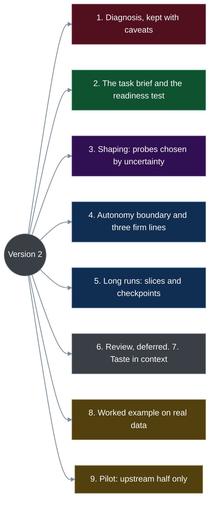
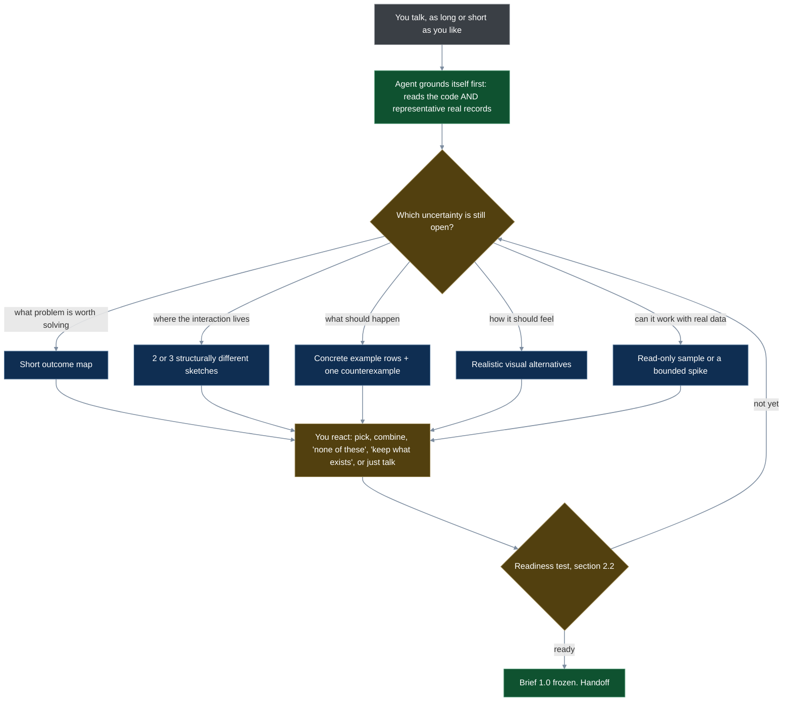
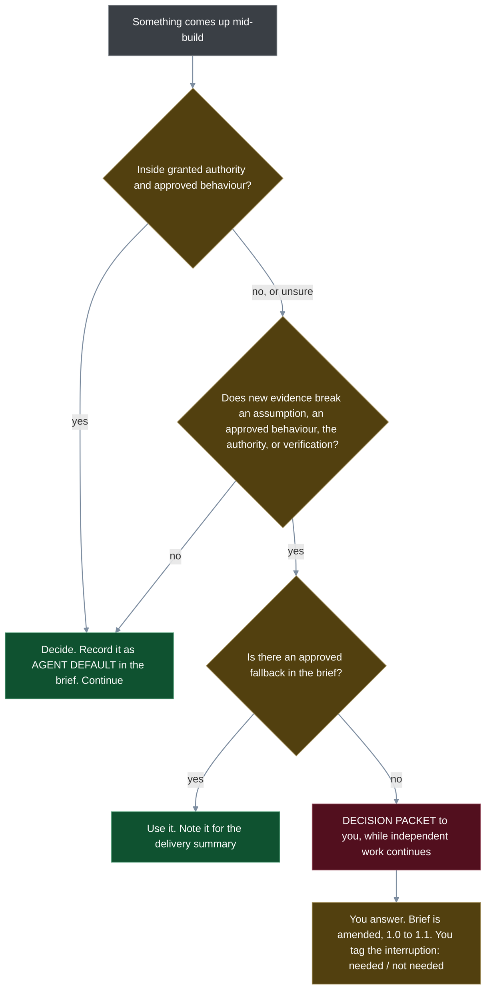
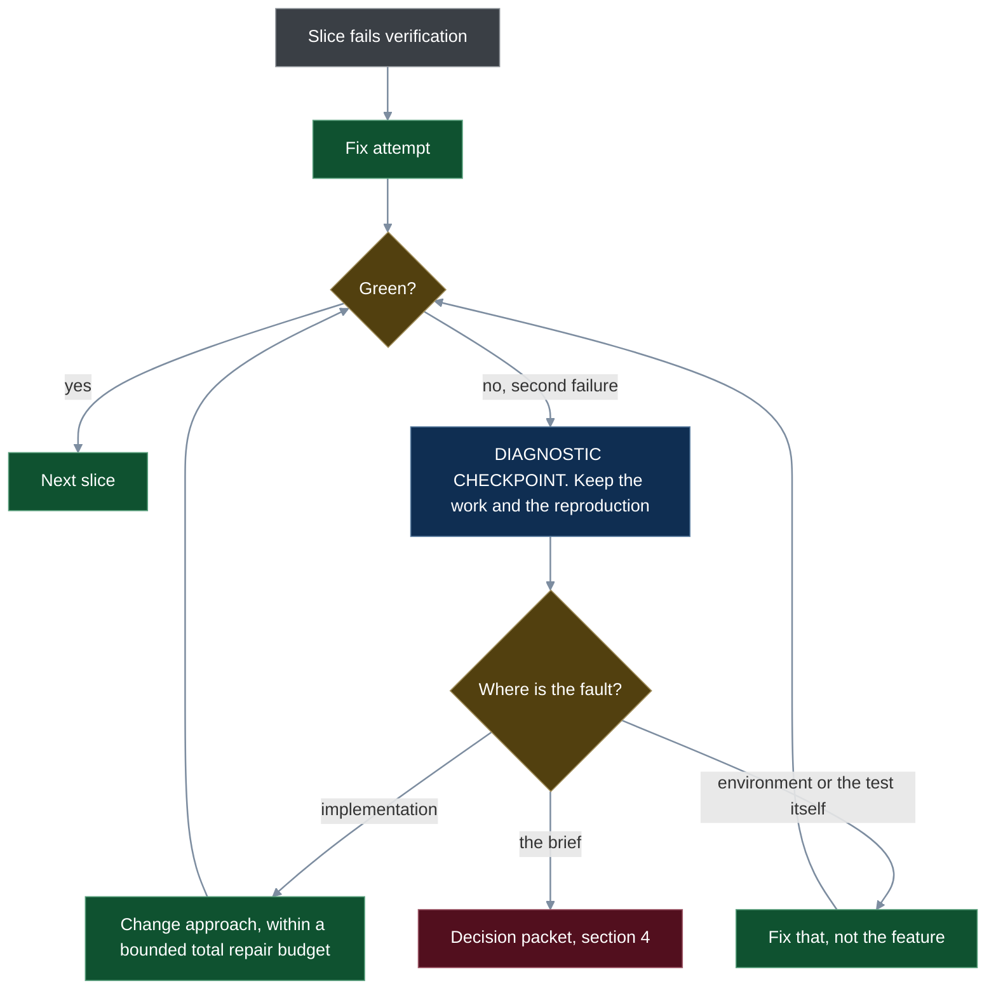

# A human-in-the-loop diet for movie-brain — version 2

*Research note, 2026-09-19. A proposal to trial, not a rule: nothing here is installed as a standing workflow override, and no past "proceed" is treated as new authority. Supersedes [version 1](2026-09-19-human-in-loop-diet.md); revised against [Astra's critique](2026-09-19-human-in-loop-diet-critique.md). Sources: 40 session transcripts, 32 specs, 29 plans, praxis-halo raw/152 and raw/155, and a read-only look at the live database for section 8.*

## 0. What changed from version 1

Version 1 specified a *presentation ritual* (three sketches, a marked table, a quiet mock review) more precisely than it specified *what the builder must know*. Version 2 turns that around. Most of version 1's mistakes had one shape: an absolute rule copied out of a research report.

| Version 1 said | Version 2 says | Why |
|---|---|---|
| Stop when you ask for zero changes and mark zero rows | Stop when understanding has been *demonstrated* (section 2.2) | silence can be fatigue or deference — the weakness version 1 itself diagnosed |
| New feature = all 11 steps; follow-up = table only | Pick each probe by the uncertainty it resolves (section 3) | move-tier was a "follow-up" that needed a migration |
| The preview is the promise | Every previewed behaviour is marked demonstrated, simulated or unresolved (section 3.2) | version 1's own example table promised two things movie-brain cannot do today |
| The contract: one sentence | The task brief is the core artifact (section 2.1) | handoff context matters more than agent architecture |
| Anything visible → escalate; never re-ask | Decide within granted authority; return only on new evidence (section 4) | both rules were too absolute in opposite directions |
| Two failed fixes → discard the branch | Two failed fixes → a diagnostic checkpoint; nothing is destroyed (section 5) | two failures do not prove the approach wrong |
| Auditor objections must be runnable | Objections need specific evidence and a consequence (section 6) | a missing search box is not a failing script |
| Taste words have fixed meanings | Taste is stored with its context and stays provisional (section 7) | one example each broke your own three-examples rule |
| No "recommended" label, shuffled options | Recommendations stay, marked; option names stay stable (section 3.3) | owner ruling: he likes them; delegating is rational |
| Trial both halves plus an auditor | Trial the upstream half only (section 9) | changing everything at once hides what helped |

## 1. The diagnosis (kept, with honest labels)

These are directional observations from one hand-classified sample, not measurements.

**Where your time went** — a proxy: the gap between my message and your reply, capped at 10 minutes. It includes idle time. Total ≈ 37 hours.

| Phase | Share |
|---|---|
| Brainstorming questions and answers | 28% |
| After "implementation complete": trying it, corrections, follow-ups | 26% |
| Direct fixes and debugging | 16% |
| Build, watching | 12% |
| Before any workflow skill ran: ad-hoc asks, list imports, data fixes | 12% |
| Plan approval gate | 4% |
| Worktree setup, plan execution | 2% |

**What the questions showed.** Of roughly 30 implementation questions, you took my recommendation 29 times. Of roughly 40 product, taste and personal-fact questions, you deviated 11 times and gave 7 free answers. Several gates got the identical answer every time ("Which approach?" 10 of 10; "Implementation complete, what next?" 17 of 17). These counts suggest *candidates* for standing authority; they do not grant it.

**Approved in words, reversed on sight:** the scope toggle, the acquire chip, the 14-day window, the list names, the drawer's service allow-list, and credits enrichment shipping with no visible search box. I found no such case in the backend work in this sample, where an executable benchmark stood in for reading.

**Corrections come in four kinds**, and only the first is a process failure:

| Kind | Example | Response |
|---|---|---|
| Misunderstood intent | the missing search box | fix the shaping and the brief |
| Implementation defect | CheapCharts links to removed products | fix the verification |
| Changed preference | "My Ranked" → "My Ranking" | cheap by design; just do it |
| Newly discovered opportunity | "that went well — order every tier" | welcome; keep it light |

## 2. The core: what the builder must know

Astra's central point, which I accept: **define what the builder knows, what it may decide, what evidence shows completion, and when new evidence sends it back to you.** Optimise your total effort through acceptance and early use — not silence after handoff.

### 2.1 The task brief — one file, two layers

One authoritative brief per feature, with linked previews. You see only the top layer. It replaces the head of today's spec; it is not an extra document.

| Layer | Part | Contents |
|---|---|---|
| **Your page** | Outcome and priority | who is trying to do what; what wins when things trade off |
| | Scope and non-goals | what will ship, what deliberately will not, what stays unchanged |
| | Chosen experience | the preview, versioned, each behaviour marked demonstrated / simulated / unresolved |
| | Acceptance examples | normal rows, one awkward row, and the evidence each needs |
| | What you will see at delivery | the summary, the screenshots, the list of anything unverified |
| **Builder's pages** | Decision provenance | **your choice** / **agent default** / **unresolved** on every decision; why rejected options were rejected |
| | Taste boundaries | hard requirements versus preferences, each with its context |
| | Execution authority | what the builder may decide, its limits, what is already authorised, what needs a separate decision |
| | Repository grounding | components, conventions, validated dependencies, test commands, known failures — gathered by the agent, never by you |
| | Recovery | how work resumes after an interruption; what "done" means |

**Provenance is what makes autonomy safe.** An agent default never silently becomes your decision. If you did not choose it, the brief says so, forever.

**Intent is frozen as a version, not as reality.** New evidence amends the brief (1.0 → 1.1): the original decision stays, with the changed assumption, its consequence, and who authorised the amendment. The brief is never quietly rewritten to match what got built.

*My one reservation about Astra's list:* every part must pass the critique's own test — "what decision would this change?" This repository already holds 191,000 words of plans. If a part of the brief never changes a decision across a few features, it goes.

### 2.2 The readiness test (replaces the stop signal)

Handoff is ready when all of these have *happened*. None of them is a "yes".

1. **You used the preview** on a representative journey that includes one consequential awkward case. Your ordinary reactions are the input — not an exam, not a test script.
2. **You reacted to a counterexample** for the highest-impact assumption. I show the awkward behaviour; you respond to what you see. ("Here is a film no streaming service carries. This is what the watch line does.")
3. **Every previewed behaviour carries a status**, and nothing on a consequential path is still *unresolved*.
4. **A cold read-back passes.** A fresh agent that has seen only the brief reconstructs the outcome, constraints, delegated choices and acceptance evidence, and flags contradictions or missing dependencies. This costs you nothing. It is a diagnostic, not a guarantee.
5. **Remaining uncertainty has an owner and a default**, written in the brief.

*Where I depart from the critique:* it also asks the agent to restate your intent for you to confirm. For a reader who tends to agree, that is another yes-gate. The cold read-back does the same job without you; the counterexample does it with something concrete to push against.

## 3. Shaping — choose each probe by the uncertainty it resolves

### 3.1 The router

| Uncertainty | Probe | Skip when |
|---|---|---|
| What problem is worth solving? | short outcome map, or a comparison with today's workflow | the outcome is already clear |
| Where should the interaction live? | two or three structurally different sketches | the existing structure is being kept |
| What should happen? | concrete example rows and a counterexample | behaviour is unchanged |
| How should it feel? | realistic visual or interactive alternatives | an approved pattern already applies |
| Can it work with real data? | read-only sample, or a bounded technical spike | the capability is already demonstrated |

For every probe the agent must be able to answer, to itself: *what decision will this change, and what happens if we skip it?* That reasoning stays out of your reading.

### 3.2 Feasibility before promise

Before a preview asks you to commit to a behaviour, the agent checks representative records and what the integrations can actually do, then marks each behaviour:

- **Demonstrated** — works today on real records.
- **Simulated** — the preview fakes it; building it is believed possible.
- **Unresolved** — nobody yet knows whether the data supports it.

Previews run on a read-only snapshot with known provenance. A clickable preview may change its own local state; it must never write to the live database or reach a real purchase.

### 3.3 How choices are presented

- **Two or three options where structure is genuinely open** — and "none", "combine these" and "keep what exists" are always valid answers. No forced winner.
- **Option names stay stable across rounds** (A stays A). Version 1's shuffling is dropped: it adds orientation work.
- **Recommendations stay, marked — owner ruling 2026-09-19: "you can mark recommendations, I like that."** Version 1 wanted to hide them and this draft proposed hiding them on the first look; both are withdrawn. You took the labelled option 51 times out of 63, and that is read as rational delegation, not as a fault to engineer away. The protection against a rubber stamp is elsewhere: the preview you actually use and the counterexample you react to (section 2.2).
- **Fidelity fits the question.** Rough sketches for navigation; a realistic slice for density, hierarchy, keyboard feel. Low fidelity is a default, not a ban.
- **The constraint binds the agent, not you.** The agent never *requires* you to compose. You remain free to think aloud, write, ask or delegate.

## 4. The autonomy boundary

### 4.1 The rule

> Within approved outcomes, constraints and delegated tolerances, decide and continue. Return a decision only when new evidence invalidates a material assumption, changes an approved behaviour or trade-off, exceeds granted authority, or prevents trustworthy verification.

The target is **zero *unnecessary* re-escalations** — not zero escalations whatever the evidence.

**The decision packet** is the smallest thing that lets you decide: what was discovered · which expectation it touches · a concrete example or preview · the recommended response · what work carries on meanwhile. Short enough to hear. The evidence need not be a pass/fail test when the question is a product trade-off.

| Situation | Response |
|---|---|
| Spacing that follows the approved component pattern | decide and continue |
| An internal helper or algorithm | decide within the established constraints |
| No direct link exists for a service | use the approved fallback; if none, a decision packet |
| A storage or dependency change | assess compatibility, rollback, cost and authority — the *category* alone never makes it safe to batch |

### 4.2 Three firm lines — my departure from the critique (accepted by the owner, 2026-09-19)

The critique replaces nearly every hard rule with a judgment call. Each replacement is right on its own. Together they make the process impossible to check — and you will not police it, while my record is asking too much. Judgment needs a counterweight:

1. **No implementation question reaches you.** If it cannot be worded as something you would see or lose, the agent decides it and records the default.
2. **Anything new on screen gets a real-data preview before it is built.**
3. **Every interruption is counted, and you tag it in one word: needed or not needed.** That single number keeps the judgment rule honest.

### 4.3 Three authorities, kept apart

Version 1 called the merge gate a ritual and then quietly restored it. The honest position: these are separate grants, and each is **yours to make explicitly**. **Owner ruling, 2026-09-19: no standing merge grant — your own hands-on acceptance test comes before every merge.** That settles the order at delivery: evidence → you try it → merge.

| Authority | Today | Candidate standing grant |
|---|---|---|
| Implementation readiness | the readiness test, section 2.2 | — |
| Merge and push | asked every time; 17 of 17 "merge" | **none — ruled out 2026-09-19.** Merge only after you have tried the feature yourself and said so |
| Live-database change | asked every time | stays a separate decision; rehearsed applies (backup, dry-run diff, scratch rehearsal) could earn a grant later, one-off fixes never |

## 5. Long runs — slices, state, and a diagnostic checkpoint

A long build is a chain of short, internally verified slices. You supervise none of them.

- **First slice: a thin end-to-end path tied to one approved example.** Had credits enrichment started this way, the missing search box would have surfaced on day one.
- **Compact state, kept current:** brief version and repository revision · completed outcomes with their evidence · open assumptions and decisions made within authority · next action and last verified checkpoint. On restart the record is reconciled against the actual repository.
- **At each slice:** check the acceptance behaviour and check for scope drift.
- **The delivery report names what is unverified.** Missing evidence is never rounded up to success.

Total repair effort is bounded, not just the count of exchanges (a counter can reset). No branch is destroyed automatically.

## 6. Review — deferred from the pilot, redefined for later

No second agent in the first trial (section 9). When one is added:

- **An objection needs specific evidence and a consequence.** A runnable reproduction where the fault is runtime; a requirement comparison, screenshot, code path or focused inspection where it is intent, scope, a misleading fallback, accessibility or an exposed value.
- **Three kinds of finding, kept apart:** correctness, deviation from intent, optional preference. Unsolicited preference churn is suppressed; explicit taste requirements are not.
- **The reviewer gets the brief, the preview, the acceptance examples, the code and somewhere isolated to run it** — not just a diff and the builder's paraphrase. Independence means freedom from the builder's persuasion, not ignorance of the product intent. There is still one integrating writer.
- **Approved examples anchor the tests; they are not the whole suite.** Agents derive boundary, regression and integration checks. A plain-language row is not executable until its binding really tests the behaviour.
- **A review with no executed or inspected evidence is simply incomplete** — on that run, not after three.
- **Judge the reviewer by risk covered, unique useful findings, false alarms and your cost.** Zero findings can mean good building.
- **Model lineage is not part of the hypothesis.** And "agents that talk are less reliable than one" was too broad a reading of raw/152; bounded exchange of evidence is the mechanism worth testing. One data point: Astra's critique of version 1 — asynchronous, file-based, mostly *not* runnable — found real faults.

## 7. Taste — contextual and provisional

"Too many" does not always mean "cap it and show N more"; it can mean duplicates, irrelevance or poor grouping. A removed scope toggle is a rejected design *in its context*, not a ban on toggles.

| Field | Example |
|---|---|
| The example | the drawer listed every service carrying the film |
| Context | a detail panel; a film on 18 services |
| Inferred reason | the answer ("where do I watch?") was buried |
| Confidence | one case — provisional |
| Known exception | none yet |

- **Explicit, project-wide preferences apply directly** — you have ruled on these: nothing filtered by default · three-way chips · filled means active, no glyphs · Clear resets everything · the list picker touches nothing else · Any language, then English · four header counts.
- **Inferences stay provisional** until a second and third case support them (your three-examples rule). Version 1's "critique words with fixed meanings" is withdrawn: each rested on one example.
- **After a correction, two things change:** the artifact, and the check that would have caught it. A taste file no building agent reads changes nothing — so taste lives in the brief's taste section, where the builder must read it.

## 8. Worked example — "where do I watch this?"

*A reconstruction, to show the mechanics. The feature already exists; your quoted words are from the 08-29 session; the data facts are from a read-only look at your live database today. It is not a record of how the feature was actually built.*

**1. Intent.** You, by voice: when I open a film I want the one best place to watch it, my services first; if I own it, that is the answer.

**2. Grounding — before any preview.** The agent reads the code and representative records:

| Behaviour you might expect | Status | What the records say |
|---|---|---|
| Mine first, a few shown, then "N more" | **demonstrated** | ranking exists; Intolerance has 18 listings, 9 on your services; one film has 47 |
| Owned → opens in the Apple TV app | **demonstrated** | for films holding an iTunes id; a fallback otherwise |
| The link lands on the film's own page | **demonstrated for Criterion only** | your other 13 subscribed streaming services have no link template set (0 of 173 streaming services), so up to 1,992 films would land on TMDB's watch page |
| The better restoration wins | **unresolved** | no code reads your presentation log; Intolerance would say Kanopy, while the copy you know is good is on JustWatch TV |

The grounding also caught version 1 itself — and then my first draft of this section. Version 1's example row said The Big Sleep is on the Criterion Channel; it is not. My draft counterexample then used The Big Sleep as "a film nobody streams"; the records say you *own* it, so its watch line reads "Owned on Apple TV". Two invented rows about one real film. **A row that names a real film has to be checked against the real record**, or the table you approve is fiction.

**3. Routing.** Outcome clear → no outcome map. The drawer exists, but how many services to show is open → two structures. Behaviour → example rows plus a counterexample. Feel → the approved drawer pattern applies; skipped.

**4. Preview, and your corrections.** Two structures on a read-only copy: (A) one watch line, then the top few, then "N more"; (B) every service, grouped. Your actual words on seeing the real thing: *"go down the preference list and list just the top few at most… then maybe a little line that says six more"* — that is A — and *"if I own it the best source should be iTunes."* Both go into the brief as **your choice**.

**5. Counterexample.** "Here is Nashville. You do not own it, and in your records no streaming service has ever carried it — only the Apple store. The watch line shows nothing; the store appears under 'Buy on'." You react to the behaviour, not to a question.

**6. Readiness.** Journey used ✔ · counterexample reacted to ✔ · statuses: "better restoration wins" is unresolved, so it moves to **non-goals** with an owner (you keep logging verdicts; revisit at three cases) ✔ · cold read-back: the fresh agent flags "owned film with no iTunes id — what then?" → a fallback is written in ✔.

**7. Brief 1.0, your page, in short.** *Outcome:* one best place to watch, mine first; owned wins. *Non-goals:* per-title restoration quality; hiding services you lack. *Approved fallback:* where no direct link exists, land on TMDB's watch page. *Examples:* Intolerance (9 of 18, "N more"), The Big Sleep (owned), Nashville (store only).

**8. An autonomous decision.** Titles must be percent-encoded inside a link template; link fields must not bloat the film-list payload. No visible consequence, inside authority → decided, recorded as **agent default**, never asked.

**9. A justified interruption.** Mid-build: "Thirteen of your services have no direct link. **Discovered:** no templates are set. **Touches:** 'lands on the film's own page'. **Example:** Intolerance → Kanopy opens TMDB, not Kanopy. **Recommend:** ship with the approved fallback now; you add templates later, one line per service. **Meanwhile:** everything else continues." The fallback was approved, so this rides in the delivery summary instead of interrupting you. Had there been no fallback, it would be a decision packet — and you would tag it *needed*.

**10. Delivery evidence.** Example rows passing as tests · three screenshots (Intolerance, The Big Sleep, Nashville) · **unverified:** link landing pages for the 13 services, named as such.

## 9. The pilot — an experiment on the upstream half only

- **Change one thing.** Trial the shaping and handoff (sections 2–4). Keep today's build process as it is. No reviewer yet.
- **No old-style baseline feature.** Recent comparable sessions are the rough baseline; building one more the cumbersome way just to measure it is waste.
- **Several comparable features, a light record.** Approximate timers or end-of-session estimates are fine; label the uncertainty.

| Measure | Purpose |
|---|---|
| Your total active minutes: shaping + interruptions + acceptance + early corrections | catches effort that merely moved upstream |
| Interruptions, each tagged needed / not needed; intent or taste surprises | tests the handoff |
| Accepted outcome, and defects found in a consistent early-use window | stops savings bought with quality |
| Elapsed time and agent cost | catches automation overhead |

Corrections are sorted into the four kinds from section 1; the sorting will not always be clean. One expensive feature triggers a look, not abandonment. A step is simplified when it repeatedly costs attention without changing a decision or catching a consequential surprise. Autonomous scope widens gradually after successful handoffs — trust follows delivery, not document length.

## 10. Decisions — all yours

1. **Run the trial?** On which backlog feature — one with something new on screen. *Open.*
2. ~~Accept the three firm lines~~ — **accepted 2026-09-19**, including tagging each interruption in one word.
3. ~~Grant standing merge authority~~ — **declined 2026-09-19**: your hands-on acceptance test comes before every merge. Live-database changes stay a separate decision as well.
4. ~~Hide my recommendation until after you choose~~ — **declined 2026-09-19**: recommendations stay and stay marked.
