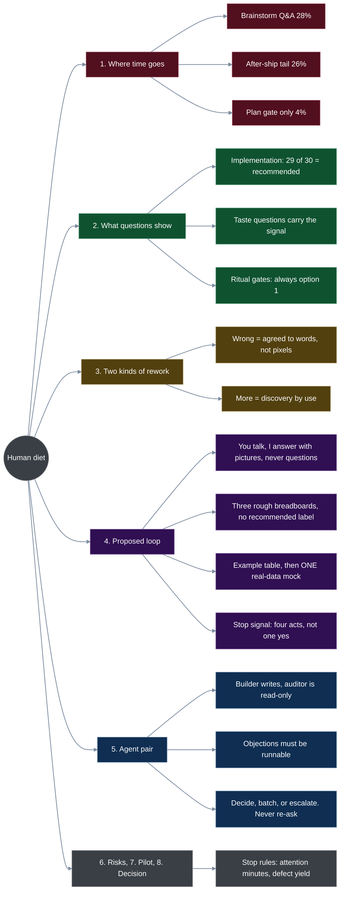
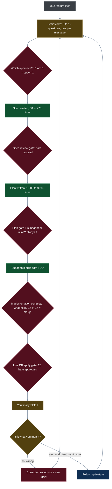
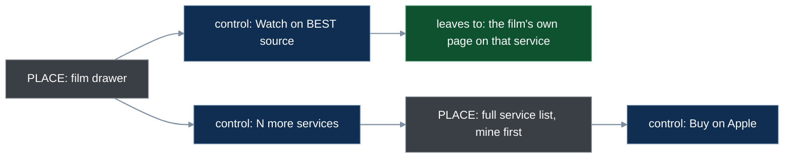
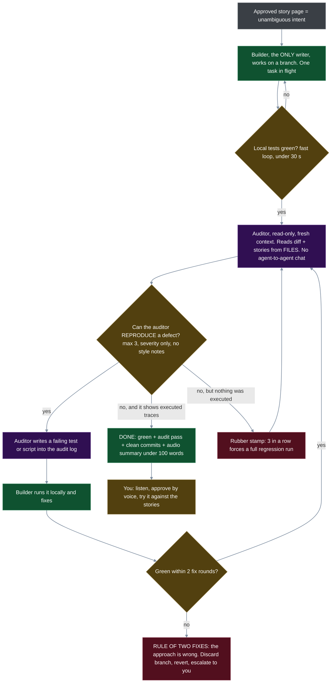
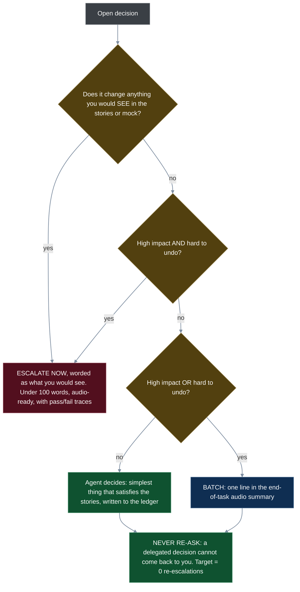

# A human-in-the-loop diet for movie-brain

*Research note, 2026-09-19 (not committed yet). Source: 40 session transcripts, 32 specs, 29 plans; section 4 revised against praxis-halo raw/155 (upstream intent synthesis), section 5 onward against raw/152 (two-agent partnership).*

## 0. Map of this doc

## 1. Where your time goes today

The headline: **reading specs and plans is not the cost** (you already skip them — 191,000 words of plans, approved with a bare "proceed"). The cost is question-and-answer rounds up front and correction rounds after shipping.

| Phase | Share of ~37 h | What it is |
|---|---|---|
| Brainstorming Q&A | 28% | one multiple-choice question per message |
| After "implementation complete" | 26% | trying the result, corrections, follow-up asks |
| Direct fixes and debugging | 16% | small follow-ups with no spec |
| Subagent build (watching) | 12% | status checks, "is it still running?" |
| Plan approval gate | 4% | bare "proceed" |
| Before any workflow skill was invoked | 12% | ad-hoc requests, list imports, live-data fixes |
| Worktree setup, plan execution | 2% | — |

*Method: gap between my message and your reply, capped at 10 minutes per turn. Includes some idle time — treat as a rough proxy, not a stopwatch.*

### 1.1 The current loop, with the gates marked

Pink = a gate where your answer was the same every single time (zero information). Yellow = a gate where your answer carried real information. Green = work you never touch.

**The structural flaw:** the first moment you see anything real ("You finally SEE it") sits at the very bottom, after five gates. Every gate above it asks you to approve words.

## 2. What the questions show

### 2.1 By kind of question (78 formal multiple-choice items, hand-classified)

| Kind | Asked | You took the recommendation | Your answer carried information |
|---|---|---|---|
| Implementation / data model | ~30 | 29 | 1 |
| Product, taste, personal fact | ~40 | ~22 | 11 deviations + 7 free-text answers |
| Workflow (merge, branch) | ~8 | almost all | ~1 |

Examples of implementation questions you were asked: "GUID as literal primary key or integer key plus GUID column?", "refresh-stamp frontier or MAX(last_seen)?", "where does N live — meta + sync?" All answered "recommended".

Examples where your answer mattered: how owned films get marked (you knew AppleScript could export), which services you subscribe to, list names, the tier-5 anchor film, what puts a non-owned film into the ranker, three-vs-five tiers.

### 2.2 Ritual gates (prose questions)

| Gate | Times asked | Your answer |
|---|---|---|
| "Which approach?" | 10 | option 1, every time |
| "Implementation complete — what next?" | 17 | option 1 (merge), every time |
| Subagent-driven or inline? | 3 | option 1, every time |
| Spec / plan review | ~19 | bare "proceed" |
| Live-DB apply | 26 | bare approval |

That is roughly 75 turns that could be standing orders.

### 2.3 The uncomfortable finding

A "1" from you on a **user-interface** question is not a reliable signal. These were all approved in words, then reversed after you saw them:

- Scope toggle (approved 08-23, removed 09-07)
- Acquire chip (built 08-29, retired 09-07)
- 14-day "new" window (now 30)
- List naming pattern (renamed wholesale 09-07)
- Drawer service allow-list (chosen, then reversed the same evening)
- Credits enrichment shipped with nothing visible — "I don't see our new search input box?"

I found no such case in the backend work in this sample. The thumbprint resolver had an **executable acceptance gate** (0 wrong, ≥90% auto-matched). You never read those plans and were never surprised. None of the 32 specs contains a mock-up or a user story — the interface work had no equivalent gate.

## 3. Two kinds of rework — only one is a defect

| | "Wrong" rework | "More" rework |
|---|---|---|
| What you say | "that's not what I meant" | "that went really well — now how would I…" |
| Cause | you agreed to words, not pixels | you learned by using the thing |
| Examples | drawer service list, scope toggle, missing search box | order every tier, ranking pool, move-tier |
| Fix | mock-up before build | lighter ceremony for follow-ups |
| Goal | eliminate | keep, make cheap |

The ranker took five follow-up specs in six days. Most of those were "more", not "wrong" — but the order-tier follow-up still got a 1,586-line plan. Ceremony should scale with risk, not with habit.

## 4. The proposed loop — first half revised after reading raw/155 (upstream intent synthesis)

**What raw/155 changed.** My first version had you approve stories, then iterate on *one* clickable mock until you stopped asking for changes. The research names two flaws in that, and your own transcripts confirm both:

1. **One proposal, refined in a loop, causes design fixation** (Dow et al., 2010 — a real and well-replicated result). You patch the first idea instead of comparing ideas. For someone who tends to agree, a single mock is the worst case: "looks good" is the path of least resistance.
2. **A polished mock too early hides structural problems.** High-fidelity output reads as "nearly done", so critique drifts to surface details. Structure should be settled on rough sketches first.

The governing idea: **you recognise, you never compose.** You talk; I answer with a picture, never with a list of questions; you pick, prune and mark. Recognition costs far less working memory than recall or reading prose.

### 4.1 Flow

Yellow = your turn (each one is a pick, a prune or a mark — never an essay). Blue = an artifact I make. The agent zone at the bottom is unchanged and detailed in section 5.

```mermaid
flowchart TD
    subgraph HUMAN["YOUR ZONE: intent, taste, flow"]
        A["1. You talk: a 2 to 5 minute brain-dump. No typing"]:::gray
        B["2. I answer with a PICTURE, never questions: outcome, opportunities, candidate solutions as a tree"]:::blue
        C{"3. You pick a branch and prune the rest. A 15-second voice note"}:::yellow
        D["4. THREE rough breadboards side by side: places, controls, connections. No styling, no 'recommended' label, shuffled order"]:::blue
        E{"5. You pick one. Add a critique word if you want"}:::yellow
        F["6. Example table on the chosen breadboard: rules, real-film rows, and my shaky assumptions written AS rows"]:::blue
        G{"7. Any row wrong?"}:::yellow
        H["8. Taste pass against your exemplars and anti-exemplars. A-versus-B only where I am unsure"]:::blue
        I["9. ONE clickable mock on read-only live data: the real-data check"]:::blue
        J{"10. Change requests?"}:::yellow
        K["11. Surprise list + frozen contract. You hear a summary and approve by voice"]:::green
    end
    subgraph AGENTS["AGENT ZONE: you almost never care, see section 5"]
        L["Builder, the ONLY writer. The example rows ARE the acceptance tests"]:::green
        M["Auditor, read-only: objections must be runnable"]:::purple
        N["Done = green + audit pass + audio summary under 100 words"]:::green
    end
    A --> B --> C --> D --> E --> F --> G
    G -- "yes: fix the rows" --> F
    G -- "no" --> H --> I --> J
    J -- "surface change" --> I
    J -- "structural change" --> D
    J -- "none, and no missing story = STOP SIGNAL" --> K
    K --> L --> M --> N
    N --> O["12. You try it against the example rows"]:::yellow
    O -- "follow-up" --> P["Light lane, section 4.8: new example rows only"]:::blue
    P --> L

    classDef blue fill:#0F2E52,stroke:#5A7DA0,color:#FFFFFF
    classDef yellow fill:#52400F,stroke:#A08D5A,color:#FFFFFF
    classDef green fill:#0F5230,stroke:#5AA07D,color:#FFFFFF
    classDef pink fill:#520F1E,stroke:#A05A6A,color:#FFFFFF
    classDef purple fill:#300F52,stroke:#7D5AA0,color:#FFFFFF
    classDef gray fill:#3A3F45,stroke:#8A8F95,color:#FFFFFF
    linkStyle default stroke:#7D8DA0,stroke-width:1.5px
```

### 4.2 Why this order — what each step catches, with a case from your history

| Step | What it catches | A time it would have helped |
|---|---|---|
| 2–3 Outcome tree | building the wrong thing; solving a data problem with a feature | power search: two of your three example searches were limited by missing credits data, not by search |
| 4–5 Three breadboards | the wrong *structure*; fixation on my first idea | the scope toggle (08-23) was the only structure offered; the three-way chips that replaced it were never on the table |
| 6–7 Example table | wrong rules; my silent assumptions; detail questions | "what puts a non-owned film into the ranker?" becomes a row you mark, not a question you decode |
| 8 Taste pass | repeating a mistake you already corrected | glyphs on chips, things filtered by default, uncredited cast — all ruled on once already |
| 9–10 Real-data mock | density and volume problems no sketch can show | the drawer listing 166 services only looked wrong with your real data in it |
| 11 Surprise list | a gap between what ships and what you picture | credits enrichment shipping with no search box |

**Where I keep something raw/155 would drop:** it wants everything upstream to stay a rough sketch. Your history says otherwise — the drawer-services reversal was a *real-data* problem a breadboard could never reveal. So rough sketches come first (structure), and exactly one real-data mock comes last (density). Both failure kinds are in your transcripts; each needs its own probe.

### 4.3 The stop signal, precisely

Brainstorming ends when **all four** hold:

1. You picked a breadboard out of three (a comparison, not an approval).
2. The example table has zero rows marked wrong.
3. One real-data mock round draws zero change requests.
4. You cannot name a missing story when asked "what would you do with this that isn't in the table?"

Every one of these is an *act* — a pick, a mark, a silence after looking. None is "does this look right? → yes", the answer your history shows you give regardless.

### 4.4 Three rules for how I present choices

Your transcripts add something the research does not: when I labelled an option "(Recommended)" and put it first, you took it 51 times out of 63. You do override the label when you already hold an opinion — in the tier-ranker session you answered 3, 3, 2, 2 on four of nine questions. My inference (not proven): where you have no formed opinion yet, **the label does the choosing** — and those are exactly the moments this zone exists to explore. So, inside your zone:

1. **No "recommended" label and shuffled order** on any structure or taste choice. If I have a view, I say it *after* you pick.
2. **Two or three options, never one, never four.** One invites a rubber stamp; four is a reading task.
3. **Options must differ in structure, not in wording.** Three breadboards that are one idea in three costumes do not count.

Recommendations stay where they belong: the agent zone, where you are not asked at all.

### 4.5 What the artifacts look like

**A breadboard** (after Ryan Singer's Shape Up) is places, controls and connections — nothing else. One of the three for "where do I watch this?" might be:

**An example table** (after Matt Wynne's example mapping) is rules plus concrete rows. You mark rows; you do not read prose. My uncertain assumptions appear as rows tagged "my guess" — this is where the detail questions go to die.

| Rule | Given | When | Then | OK? |
|---|---|---|---|---|
| Mine first | The Big Sleep is on Criterion Channel (subscribed) and Tubi | I open its drawer | "Watch on Criterion Channel ↗" | |
| The link is direct | same | I click it | the film's own page, not a search | |
| A better transfer wins | Intolerance is on two services, one a known good restoration | I open its drawer | the good one is named | |
| **My guess** | a film is on 9 services | I open its drawer | 3 shown, then "6 more" | ? |

movie-brain already runs pytest-bdd, so approved rows become `tests/features/*.feature` scenarios almost line for line. The table you marked *is* the acceptance test the auditor runs.

### 4.6 The taste file — exemplars, anti-exemplars, critique words

Taste cannot be asked for ("describe your preferred density" fails for everyone). It is captured three ways, and you already use the first one: the tier ranker and the tutor cartridge both prefer pairwise comparison to weighted rubrics.

| Mechanism | What it is | Seeded from your history |
|---|---|---|
| A-versus-B | two variants, you pick; used only where I am unsure | — |
| Exemplars | things that are right; copy them | nothing filtered by default · three-way chips · filled means active, no glyphs · Clear resets everything · the list picker touches nothing else · four header counts |
| Anti-exemplars | things you reversed; never again | the scope toggle · a service allow-list · uncredited cast · maintenance detail above content · shipping with nothing visible |
| Critique words | your own short corrections, given a fixed meaning | "too many" → cap and show "N more" · "move it lower" → maintenance sinks to the bottom · "don't show that" → remove, keep the data · "X after Y" → reorder only |

I would not adopt the report's Bradley-Terry scoring model; a plain pick and a growing file do the job. Note also that the report's own list of critique tokens arrived **blank** (the extraction stripped them), so the words above are yours, from your transcripts — which is better anyway, and follows your three-real-examples-before-abstracting rule.

### 4.7 Features with no screen

Same steps, different materials. The breadboard is a data-flow sketch (source → resolver → gate → table). The example table is unchanged. The real-data mock is a **sample scorecard**: dry-run output on 10 real rows, before and after. You already react well to these (the list imports, the CheapCharts recheck tally).

### 4.8 Ceremony scales with the size of the thing

| Size | Example | Steps you see |
|---|---|---|
| New feature | the tier ranker | all of 1–11 |
| Follow-up ("more" rework) | order every tier | new example rows only (6–7), then build |
| Tweak | "owned badge after the list count" | none — a two-line story, just built |

### 4.9 Where I depart from raw/155

- **"The agent never asks a question" is too absolute.** Personal facts only you hold (which services you subscribe to, how many films you own) carried real information in your transcripts. Those get asked — batched, once, as facts, never as design choices.
- **Two parallel *story sets* is a reading tax.** Parallel options belong where comparison is visual and cheap (breadboards). For examples, one table with my guesses flagged does the same job at half the reading.
- **The outcome tree is for new features only.** A full opportunity tree for "move the audit block lower" would be theatre.
- **Its evaluation plan (20 features, workload questionnaires, randomisation statistics) is a research study, not a habit.** Section 7 borrows two of its measures and leaves the rest.
- **Provenance.** The classical sources are real and I know them (Dow on parallel prototyping, Boehm's "I know it when I see it", Buxton on sketches, Schön, Torres, Singer, Adzic, Wynne, Patton). Several 2026 citations (the `impeccable` and `dotdog` tools, the Manning book, "Rehan 2026") I cannot verify. Nothing above depends on them.

## 5. The agent pair — revised after reading raw/152 (two-agent partnership)

Your instinct is right, with one adjustment from your own data: implementation questions do not need *better answers* (the recommendation held 29 of 30 times) — they need to *not reach you*. The research adds a second adjustment: **two agents that talk to each other are less reliable than one agent alone.** The shape that holds up is a *builder* who is the only writer and an *auditor* who is read-only, works from files, and may object only with something runnable.

What changed from my first diagram: I had "drafter and challenger disagree → after one round, escalate to you." That is a debate, and debate is exactly the failure the research documents (performative critique, mutual approval without evidence, endless review). Disagreement is now settled by **running the objection**, not by arguing it, and not by asking you.

### 5.1 The build–audit loop

Three guardrails keep the loop from spinning (all from raw/152, all cheap to enforce):

| Guardrail | Rule | Failure it prevents |
|---|---|---|
| Critique cap | at most 3 high-severity defects per audit; style and preference notes are dropped | performative critique |
| Rubber-stamp detector | 3 approvals in a row with no executed trace → compulsory regression run | mutual approval without evidence |
| Endless-review cutoff | more than 2 audit exchanges on one task without green → pause, audio incident report to you | infinite review loops |

### 5.2 Who decides — impact × reversibility, plus your "visible" rule

This replaces my three yes/no diamonds. The new idea is the middle lane: **batch**. A batched decision never interrupts you; it rides along in the end-of-task audio summary as an "assumptions I made" line.

| | Easy to undo | Hard to undo |
|---|---|---|
| **Low impact** | **Agent decides** — refactors, helpers, test shape, internal naming | **Batch** — new dependency, a new API field, log/output formats |
| **High impact** | **Batch** — swapping an internal algorithm, internal storage format | **Escalate now** — live-DB migration, anything touching film identity, data loss |

Example of the wording rule. Not: "refresh-stamp frontier or MAX(last_seen)?" Instead: "If Peacock drops to zero films, should its old films keep showing as available, or disappear? I recommend disappear."

The **never re-ask** rule is the direct answer to your complaint about detail questions: once a domain is delegated, ambiguity inside it is resolved by picking the simplest option that satisfies the stories and writing it down — not by asking.

### 5.3 Principle → practice (what I took from raw/152)

| Principle | Practice here | Where it shows |
|---|---|---|
| Single writer per repo | only the builder writes; the auditor is read-only | 5.1 |
| Coordination cost (no agent chat) | handoffs are files: decision ledger, diff, audit log | 5.1 |
| Verification is execution, not reading | an objection counts only as a failing test or script; your past UI rulings become runnable checks on the mock | 4.1, 5.1 |
| Fast feedback before crossing a boundary | local tests green before the auditor or you see anything | 5.1 |
| Human review is the bottleneck | one task in flight; never generate faster than you can review | 4.1, 5.1 |
| Attention is the scarce resource | every escalation under 100 words, audio-ready, with pass/fail traces | 5.2 |
| Rule of two fixes | two failed fix rounds = wrong approach → revert and escalate | 5.1 |
| Re-escalation prevention | delegated decisions never return; counted, target zero | 5.2 |
| Ambiguous intent poisons a pair | stories + mock page must be approved before the pair starts | 4.1 |

### 5.4 The auditor's lineage — my recommendation differs from the report's

The report recommends a **different model family** as auditor (ChatGPT Agent, "Astra") because two copies of one model share blind spots. I agree with the reasoning and disagree with the starting point:

1. **Start same-lineage, fresh-context.** A read-only Claude subagent that sees only the diff, the stories and the audit log — never the builder's conversation. Zero new infrastructure, testable this week.
2. **Measure its defect yield** (section 7). If it finds real, reproducible defects, keep it.
3. **Go cross-lineage only if yield is low.** That adds a remote sandbox, GitHub sync and a monthly message cap — real overhead for a one-person repo. movie-brain is public on GitHub, so it is possible; it is just not the first step.

## 6. Risks and honest limits

- **Treat raw/152's numbers with care.** It is a generated deep-research report. The principles trace to real sources (the MAST failure taxonomy, the METR trial, Anthropic's agent-pattern guidance). But the topology table (3.5× latency, ~45% failure, 0.4× attention) cites nothing, and nearly every sentence is stamped "[Robust]". I adopted the practices that are cheap and make sense on their own; I would not quote its numbers.
- **Shared blind spots** remain with a same-lineage auditor. Executable gates (benchmarks, story tests) are still the real safety net; the auditor is a filter, not a guarantee.
- **The two reports cover different halves.** raw/152 is about code correctness and says nothing on taste; raw/155 is about intent and taste and says nothing on correctness. The frozen contract (step 11) is the only thing that crosses between them, so it has to be complete: outcome, in and out of scope, the chosen breadboard, the example rows, exemplars and anti-exemplars.
- **Three breadboards cost more agent time and a little more of yours.** The bet is that one comparison beats three rounds of patching. If you find yourself always picking the same kind of option, the taste file has learned it and the count can drop to two.
- **Mock-ups cost build time up front.** Worth it for anything new on screen; skipped for tweaks (two-line story instead).
- **Live-DB gate.** A live migration sits in the "escalate now" cell. Dropping the gate is safe only for *rehearsed* applies (backup + dry-run diff + scratch-copy rehearsal); one-off data fixes keep your one-at-a-time rule.
- **My classification is by hand.** The 29-of-30 number is solid; the product/taste split is approximate.
- **"More" rework will not go away,** and should not. If follow-ups drop to zero, the tool has stopped teaching you what you want.

## 7. Pilot — how we would know it works, and when to stop

Baseline first: the next feature built the current way, measured. Then the new loop on features of similar size.

| Metric | What it counts | Stop or revert if |
|---|---|---|
| **Attention minutes per result** (primary) | your active minutes per accepted feature | new loop ≥ baseline |
| Questions that reached you | escalations + brainstorm questions | not clearly below baseline |
| Re-escalated delegated decisions | detail questions that came back | more than 0 |
| "Wrong" corrections after ship | "not what I meant" rounds | not below baseline |
| Plan drift (from raw/155) | times you had to step in mid-build because intent was missed | not below baseline |
| Convergence time (from raw/155) | minutes from brain-dump to frozen contract | grows feature over feature |
| Rework loops | times a task went back for fixes after "done" | average above 2 per task |
| Auditor defect yield | real defects the auditor reproduced that the builder's tests missed | 0 across 10 tasks → retire the auditor |
| Audit attention tax | your minutes spent on audit reports and agent disputes | above 2 minutes per task |
| Two-fix deadlocks | branches discarded under the rule of two fixes | 2 in a row → halt, halve the scope, restate intent |

## 8. Open decision

Draft `.claude/rules/design-loop.md` (it overrides the superpowers brainstorming gates — your instructions outrank skills) and trial it on **one** visible backlog feature, with a same-lineage read-only auditor and the section 7 scorecard. Three calls are yours: whether to run a measured baseline feature first; whether you want the cross-lineage auditor from day one despite the overhead; and whether you accept losing the "(Recommended)" label inside your zone — it is the change most likely to feel like more work, and the one your own data argues for hardest.
