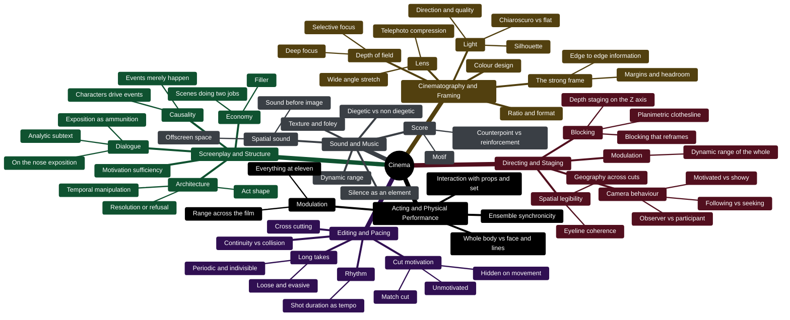

# The Cinema Flavor Wheel

A vocabulary tree for film craft, modelled on the tasting wheels used in sensory trades. It carries no weights, no scores, and no threshold. It exists so a learner can name what was perceived and make the naming communicable — to a tutor, to a critic's text, to a later self. It is the core content of the tutoring cartridge: every term below is a handle the tutor can supply and the learner can reach for.

## A tree, not a scorecard

The standard objections to rubrics in aesthetic evaluation — anchoring, criteria compliance, construct-irrelevant narrowing ([[film-canon-epistemology]]) — all target a pre-weighted scoring instrument. A descriptive term tree is a different object, and the evaluative instrument those objections recommend presupposes one: a craft channel cannot be traced as a formal system without the terms for what a craft channel is made of. So the wheel does no arithmetic. It answers "what is it doing?" and nothing else.

Judgment — does the film clear the bar? — is a separate instrument with a yes-or-no answer. The wheel only shows where on the tree that judgment lives: it is a non-compensatory question on conception, screenplay, structure, and directing, and everything else is executional and cannot buy a film past it. The sensory-taxonomy literature reaches the same conclusion independently, warning that a high score in cinematography or sound can average out a failing screenplay and admit structurally incoherent films to a canon.

- Wheel = description. What is it doing? Name it.
- Gate = judgment. Does it clear the bar? Yes or no, no arithmetic.

**Never let the wheel become a checklist.** The moment it is something to work through rather than something to reach for, it has become the instrument the objections refused.

## Timing: between films, never during

The wheel is learned between films and deployed after them. It is never consulted during a viewing: tasting is discrete and self-paced, a film is not, and a document in the lap converts watching into scanning-for-instances. In practice the tutor holds the wheel — one channel is named in the pre-watch brief ([[film-study-protocol]]), and terms are supplied in the debrief when the learner has perceived something and lacks the word for it.

## The tree

Six craft channels, three rings. The fenced block reads as an indented outline without a diagram renderer.

## What the wheel makes visible

A quality can be jointly owned. A cast that plays everything at eleven so that nothing stands out is a modulation failure, and modulation sits under directing as much as under performance — a reframe the learner cannot reach without the vocabulary. The wheel also reveals when several observations on different branches are one preference: a taste for contrast in light, in tone, and in performance is one sensibility expressed three ways, not three opinions. That is the wheel connecting perception to [[taste]].

## Corrections from the sensory-taxonomy evidence

### Causal sorting: one term, one home

Sensory taxonomies enforce non-overlapping descriptors; overlapping definitions are what make a tree unlearnable. The fix used in wine and spirits education is causal sorting — categorise by causal origin, not by similarity. Modulation and dynamic range appear under Directing, Sound, and Acting in the tree above. Under causal sorting the term is owned by Directing, because modulation across a whole film is the director's job, and the sound and performance entries are references to it rather than copies. The insight survives; the duplication does not. Redraw the diagram accordingly when the tree is next revised.

### The missing axis: observable vs interpretive

Every term needs a physical anchor and a separately stated interpretive claim.

| Parameter | Observable anchor | Interpretive claim |
|---|---|---|
| Temporal duration | Shot length in frames or tenths of a second | Kinetic energy · drag · suspense |
| Staging geometry | Camera perpendicular to a rear flat wall; zero receding diagonals | Modernist alienation · mechanical containment |
| Physical blocking | An actor playing with their back to the lens (dorsality) | Dedramatisation · psychological opacity |
| Acoustic environment | Off-screen diegetic sound; measurable reverberation | Activated off-screen space · claustrophobia |
| Editing distribution | Median shot length under 2.0 s with high coefficient of variation | Intensified continuity · fragmentation |
| Narrative device | An unmotivated coincidence; an unresolved dangling cause | Subversion of classical realism · existential randomness |

This is what lets a divergence between learner and critic be adjudicated. Two people arguing about "alienation" cannot settle it; two people arguing about whether the camera is perpendicular to the wall can. The fuller taxonomy behind the split is [[film-craft-taxonomy]].

### Three or four rings, hard limit

Working memory. Taxonomies past four concentric rings get applied inconsistently. The wheel is at three and must not grow a fourth without dropping something.

### The learning order: terms by yield

Not the whole wheel at once. Terms are ordered by visual salience × physical anchoring × diagnostic power.

- Tier 1 (extreme yield, robust evidence): shot scale (Salt's seven scales) · median shot length · planimetric vs recessive staging. Three terms with immediate salience in every genre. Start here.
- Tier 2 (high yield, robust): aperture framing · dorsality · dialogue hooks · dangling causes.
- Tier 3 (medium yield, emerging): coefficient of variation of shot lengths · lag-1 autocorrelation · moving-average waves · off-screen sound depth. Needs tooling or very focused listening.

Also on record: composite judgments beat individual ones in every sensory-evaluation domain studied — the empirical case for more than one judge at the table, and against the tutor being the only one.

## Standing cautions

- Ring 3 is the weakest ring and the most likely to be wrong. Its terms were drawn from framing-and-staging reports; a film-native taxonomy may cut them differently.
- The diagram still shows the seed layout. The causal-sorting fix and the observable/interpretive axis are described above but not yet drawn.
- The wheel is a vocabulary for the loop in [[film-study-protocol]] and the argument in [[film-socratic-debate]]; it is not a syllabus. What to learn next is written by the learner's misses, not by the tree.

Related: [[how-taste-is-taught]] · [[can-taste-be-tutored]]
